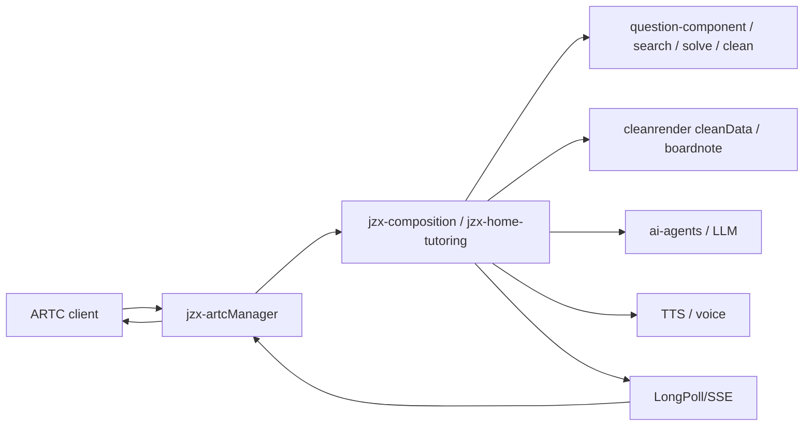

# JZX SLS Configuration and Query Playbook

This file is the self-contained SLS reference for `jzx-workorder-debugging`. Use it before querying logs.

## Tool

- Preferred MCP/tool name: `Alibaba_cloud_observability_test.sls_execute_sql`
- If the tool is not in the active tool list, search for `Alibaba_cloud_observability_test`.
- Use read-only SLS queries only.
- Do not mutate production systems.
- Do not replay production requests unless the user explicitly approves and the endpoint is known to be side-effect safe.

## Trace Fields

Use the strongest available identifier:

1. `EagleEye-TraceID` / `traceId`
2. `roomId`
3. `roundId`
4. `lectureQuestionId`
5. `pid/qid/subQid`
6. `userId`
7. device SN
8. interface path + problem time window

When traceId is absent, combine time window + device/user + path and then recover traceId from matching logs.

## Environments

### Test

Use this test project first:

| Field | Value |
| --- | --- |
| region | `cn-hangzhou` |
| project | `k8s-log-ce24edc82a57847669a3929be5d67edc0` |
| logstore | `test-app-log` |

Common containers:

| Service | Container |
| --- | --- |
| jzx-composition / home tutoring | `test-zstt-jzx-home-tutoring` |
| artcManager | `test-zstt-jzx-artcmanager` |
| ai-dual-mentor | `test-zstt-ai-dual-mentor` |
| cleanrender | `test-zstt-cleanrender-comments` |
| graphickites / GK | `test-zstt-jzx-graphickites-comments` |
| ai-agents | `test-zstt-ai-agents` |
| lecture-component | `test-zstt-lecture-component` |
| question-component | `test-zstt-question-component` |

Known obsolete test project:

| Field | Value |
| --- | --- |
| old project | `k8s-log-cf194c581f4c848d8a051abe4c1b2a8de` |
| issue | Returned `401 The project does not belong to you` in prior Codex sessions. Prefer the `ce24...` project above. |

### Production Base

| Field | Value |
| --- | --- |
| region | `cn-hangzhou` |
| project | `k8s-log-c292481d697254c0cb6272d5a74f3c5c1` |
| logstore | `prod-app-log` |

Common base containers:

| Service | Container |
| --- | --- |
| jzx-composition / home tutoring | `prod-zstt-jzx-home-tutoring-base` |
| artcManager | `prod-zstt-jzx-artcmanager-base` |
| ai-dual-mentor | `prod-zstt-ai-dual-mentor-base` |
| question-component | `prod-zstt-question-component-base` |
| poseidon | `prod-zstt-poseidon-base` |
| cleanrender | `prod-zstt-cleanrender-comments-base` |

### Production Gray / New

| Field | Value |
| --- | --- |
| region | `cn-hangzhou` |
| project | `k8s-log-c292481d697254c0cb6272d5a74f3c5c1` |
| logstore | `prod-app-log` |

Common gray/new containers:

| Service | Container |
| --- | --- |
| jzx-composition / home tutoring | `prod-zstt-jzx-home-tutoring-new` |
| artcManager | `prod-zstt-jzx-artcmanager-new` |
| ai-dual-mentor | `prod-zstt-ai-dual-mentor-new` |
| question-component | `prod-zstt-question-component-new` |
| poseidon | `prod-zstt-poseidon-new` |

## Common Keywords

Use these to discover logs:

- `APPLICATION VERSION`
- `RequestMonitor`
- interface path, for example `/home-tutoring/exampaper/lecture/studentSpeakLectureStream`
- `traceId`
- `EagleEye-TraceID`
- `roomId`
- `roundId`
- `lectureQuestionId`
- `pid`
- `qid`
- `subQid`
- `cleanData`
- `keywordTtsSyncWithMeta`
- `TTS_AUDIO`
- `BOARD_NOTE`
- `boardNoteStreaming`
- `applyLectureNew`
- `createRoom`
- `updateLecturePlayedRecord`
- business error code, for example `B0001`

## Query Discipline

1. Use absolute ticket time window first. Do not attribute logs outside the ticket window as root cause.
2. Query the actual request trace before relying on deployment UI.
3. Confirm whether the request hit `*-base` or `*-new`; release status alone is insufficient.
4. For every candidate root cause, collect both:
   - log evidence: timestamp, container, trace/span, input/output fields
   - code evidence: repo, branch/version, file/method, line or exact logic
5. If SLS payload is truncated in the UI, query a narrower set of fields or exact trace and preserve the decisive field values.
6. Redact credentials, cookies, access keys, and direct personal contact data in final reports.

## Common SLS Query Shapes

Use the exact syntax supported by the active SLS tool. These are intent templates, not guaranteed copy-paste SQL for every tool wrapper.

Exact trace:

```sql
* and "TRACE_ID_OR_EAGLEEYE_ID"
| select __time__, __tag__:_container_name_ as container, content
| order by __time__ asc
limit 200
```

Room within time window:

```sql
* and "ROOM_ID"
| select __time__, __tag__:_container_name_ as container, content
| order by __time__ asc
limit 500
```

Container + path:

```sql
__tag__:_container_name_: "prod-zstt-jzx-home-tutoring-base"
and "/home-tutoring/exampaper/lecture/studentSpeakLectureStream"
and "USER_OR_ROOM_OR_TRACE"
| select __time__, content
| order by __time__ asc
limit 200
```

Version/runtime:

```sql
__tag__:_container_name_: "test-zstt-jzx-home-tutoring"
and "APPLICATION VERSION"
| select __time__, content
| order by __time__ desc
limit 20
```

## Known Pitfalls

- DevOps `已发布` does not prove the request used the new image. Confirm with actual request logs and container/image/version.
- `applyLectureNew` or create-room returning quickly does not prove the user-perceived flow was fast; AI generation, TTS, LongPoll/SSE, and boardnote are asynchronous.
- `jzx-artcManager applyLectureNew 60s timeout` covers synchronous room opening, not first audible response or boardnote completion.
- For boardnote delay, compare both business gateway request duration and artcManager complete processing duration.
- `updateLecturePlayedRecord` timeout can affect later student turns; inspect non-JSON upstream timeout handling and whether played boardnote record exists.
- A screenshot that shows mismatched content proves a user-visible mismatch, not the first bad hop. Still reconstruct log/code chain.

## Typical Service Chain



## Work-Order Specific Checks

### Response Slow / 卡顿

Check:

- create/open-room latency
- first model response timestamp
- cleanData latency
- TTS request and first TTS event
- boardnote first chunk and completion
- artcManager complete processing timestamp
- update played record failures before the next user turn

Do not conclude from only one endpoint duration.

### Wrong Question / 讲错题 / 题目不对应

Check:

- selected `route/pid/qid/subQid`
- search result payload and image/stem/answer/solution
- normalization fields: `originalTarget*`, `target*`, `question*`
- persisted `AILectureQuestion`
- prompt input to model
- boardnote/TTS input
- any later solve/clean/merge stage that overwrote correct fields

### TTS / 读错

Check:

- model text before TTS
- cleanData request: `subject`, `text`
- cleanData response
- TTS request content
- subject source in code
- whether that path calls cleanData before TTS
